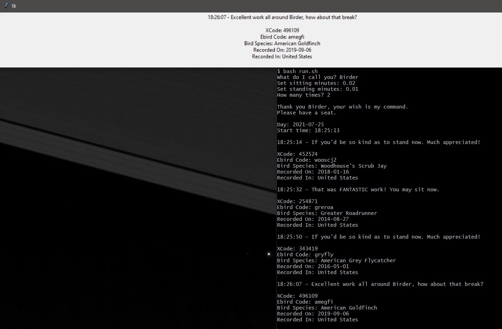

# Birdcall Recognition

**A repo for all sorts of birdy things.**

Siriema hatchling by <a href="https://pixabay.com/users/jrperes-103619/?utm_source=link-attribution&amp;utm_medium=referral&amp;utm_campaign=image&amp;utm_content=634171">Junior Peres Junior</a> from <a href="https://pixabay.com/?utm_source=link-attribution&amp;utm_medium=referral&amp;utm_campaign=image&amp;utm_content=634171">Pixabay</a>

  
## Synopsis

This repo was originally intended as a place to host my work in connection with the [Cornell Birdcall Identification Competition in Kaggle](https://www.kaggle.com/c/birdsong-recognition).

For "reasons", I ended up not entering this competition, but since I had all this fantastic audio and metadata on birdcall  identification, I held on to it just in case I thought of a use for it.

And in time, I did.

---

## A Birdcall Timer

My partner needed a customizable timer for sitting and standing while doing her computer work at a standup desk. 

She's also a bird-watching geek. 

Image By <a href="https://pixabay.com/users/clker-free-vector-images-3736/?utm_source=link-attribution&amp;utm_medium=referral&amp;utm_campaign=image&amp;utm_content=40093">Clker-Free-Vector-Images</a></a>

I created a simple timer that randomly draws from a collection of birdcalls and plays one, while also displaying some information about that bird, and its picture.

*DISCLAIMER: I am not responsible for any brain damage associated with the following logic and/or joke.*

My best half insists, with great joy (undoubtedly at my suffering) that by hearing the birdcall **and** seeing the bird, she will have "killed two birds with one stone" - a magical metaphor for learning the name, appearance, and song of a bird all at once.

---

## Demo

REDO... use pictures!

Here's a brief demo picture of the timer after a quick run using sub-minute wait times.

I'm hoping you can guess how the timer works - failing that, you could guess what the bright dot on my desktop backgroud is.

---

## Running the Timer 

TODO...

---

## Reproducing the Timer 

TODO...

---

## Limitations and Future Steps

TODO...

---

